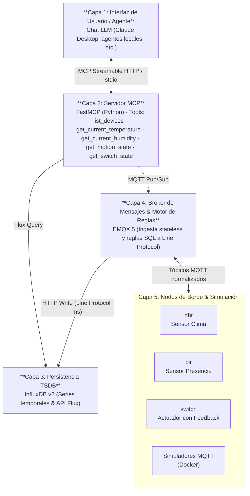

# SensorHub 🌐🤖

> **Taller de Proyecto II (2026) — Grupo G4**
> Plataforma IoT para interacción con Modelos de Lenguaje (LLM) mediante **Model Context Protocol (MCP)**.

---

## 📋 Tabla de Contenidos

- [Descripción del Proyecto](#-descripción-del-proyecto)
- [Arquitectura del Sistema](#-arquitectura-del-sistema)
- [Principios Rectores](#-principios-rectores-de-arquitectura)
- [Flujos de Información](#-flujos-de-información-de-punta-a-punta)
- [Tecnologías Principales](#-tecnologías-principales)
- [Contrato de Mensajería MQTT](#-contrato-de-mensajería-mqtt)
- [Infraestructura y Pipeline](#-infraestructura-y-pipeline-emqx--influxdb)
- [Servidor MCP y LLM](#-servidor-mcp-y-llm)
- [Obtención del Proyecto](#-obtención-del-proyecto)
- [Documentación y Wiki](#-documentación-y-wiki)

---

## 📖 Descripción del Proyecto

**SensorHub** es una plataforma IoT experimental que busca conectar dos mundos tecnológicamente muy diferentes:

- **La computación física y el Internet de las Cosas (IoT):** Microcontroladores de bajo consumo (ESP32), sensores analógicos y digitales, buses asíncronos y protocolos de red de borde.
- **Los Modelos de Lenguaje (LLM) y Agentes Inteligentes:** Sistemas de razonamiento en lenguaje natural capaces de interpretar intenciones humanas, sintetizar información compleja y tomar decisiones contextuales.

Para que un LLM pueda operar sobre un hogar, laboratorio o industria, requiere una interfaz estandarizada, determinística y segura. Esa interfaz es el **Model Context Protocol (MCP)**.

A través de herramientas (*tools*) estandarizadas, asistentes de IA (como Claude, Gemini o modelos locales) pueden:

| Capacidad | Descripción |
| :--- | :--- |
| 🌡️ **Telemetría ambiental** | Lecturas en tiempo real e históricas de temperatura y humedad (sensores DHT) |
| 🚨 **Monitoreo de presencia** | Detección de movimiento reactiva (sensores PIR) |
| 💡 **Control de actuadores** | Conmutación de relés y luces con confirmación física (*feedback loop*) |
| 🔍 **Descubrimiento de dispositivos** | Detección dinámica de la flota (`list_devices`) y supervisión via LWT |
| ⏱️ **Registro temporal preciso** | Ingesta de datos con marcas de tiempo en milisegundos (`ts`) desde el origen |

---

## 🏛️ Arquitectura del Sistema

El sistema opera bajo un esquema desacoplado de **5 capas**:



---

## 🧭 Principios Rectores de Arquitectura

El diseño del stack Firmware ↔ MQTT ↔ TSDB se rige por cuatro premisas fundamentales:

1. **Desacoplamiento total de sensores:** Los microcontroladores solo interactúan con tópicos estandarizados en el broker MQTT. Si el servidor MCP o el LLM están apagados, los sensores continúan midiendo y registrando en la base de datos sin afectación alguna.

2. **Fuente Única de Verdad (*Single Source of Truth*):** La identidad y la clase funcional de un dispositivo residen exclusivamente en la estructura del tópico MQTT (`sensorhub/<device_type>/<device_id>/<canal>`). Los cuerpos de mensaje en JSON contienen únicamente la información propia de cada sensor, sin redundar metadatos.

3. **Broker Efímero vs. Persistencia en TSDB:** El broker EMQX es 100% libre de estado (*stateless*) — puede destruirse o recrearse en frío en cualquier momento sin perder historia. Toda la persistencia de series temporales, confirmaciones de actuadores y eventos de ciclo de vida recae en **InfluxDB v2**, que sí tiene almacenamiento persistente.

4. **Escalabilidad horizontal:** La arquitectura soporta diferentes *tipos* de dispositivo, cada uno con múltiples instancias identificadas por `device_id`. La estructura de los tópicos refleja esta jerarquía y permite incorporar nuevos tipos de nodo sin modificar el stack de backend.

---

## 🔄 Flujos de Información de Punta a Punta

### Escenario A — Telemetría Climática y Eventos de Presencia (Query Path)

```
Sensor DHT/PIR → MQTT (sensorhub/dht/<id>/telemetry)
    → EMQX Rule Engine (SQL)
    → InfluxDB v2 (Line Protocol, ts en ms)
    → MCP Server (consulta Flux)
    → LLM (respuesta en lenguaje natural)
```

1. El sensor DHT lee temperatura y humedad periódicamente.
2. El firmware genera un payload JSON con timestamp de origen (`ts`) y publica en `sensorhub/dht/<id>/telemetry`.
3. El motor de reglas de EMQX intercepta la publicación, extrae identificadores del tópico vía SQL, construye la línea en Line Protocol y realiza un HTTP POST a InfluxDB.
4. InfluxDB indexa los tags `device_type` y `device_id`, y guarda los campos numéricos en la serie temporal.
5. Al consultar el LLM *"¿Cuál fue la temperatura promedio del living en la última semana?"*, el servidor MCP ejecuta la tool correspondiente con una consulta Flux a InfluxDB y devuelve los datos consolidados.

### Escenario B — Conmutación de Actuador con Confirmación Física (Command Path)

```
LLM → MCP Tool (set_switch_state)
    → MQTT Publish (sensorhub/switch/<id>/command)
    → ESP32 actúa físicamente (GPIO)
    → ESP32 publica acuse (sensorhub/switch/<id>/telemetry)
    → MCP Server confirma al LLM
    → EMQX Rule Engine → InfluxDB (registra estado histórico)
```

1. El usuario solicita al LLM: *"Apaga la luz de la oficina"*.
2. El LLM invoca `set_switch_state(device_id="<id>", state="off")`.
3. El servidor MCP publica en `sensorhub/switch/<id>/command` el payload `{"state": "off"}` y aguarda síncronamente la respuesta en el canal de telemetría.
4. El microcontrolador conmuta el GPIO físicamente, verifica el pin y emite el acuse en `sensorhub/switch/<id>/telemetry`: `{"state": "off", "ts": <epoch_ms>}`.
5. El servidor MCP recibe la confirmación y le informa al LLM con certeza que la acción fue ejecutada (no solo que el broker recibió el mensaje).
6. Simultáneamente, EMQX guarda en InfluxDB el nuevo estado (`state="off"`, `value=0`) para el registro histórico.

---

## 🛠️ Tecnologías Principales

| Componente | Tecnología | Rol en la Plataforma |
| :--- | :--- | :--- |
| **Protocolo de IA** | [Model Context Protocol (FastMCP)](https://modelcontextprotocol.io/) | Servidor MCP en Python que expone herramientas de consulta y control al LLM. Transporte Streamable HTTP. |
| **Broker MQTT** | [EMQX 5](https://www.emqx.io/) | Ingesta de mensajería de alta concurrencia y motor de reglas SQL *stateless* que escribe directamente en InfluxDB. |
| **Base de Datos** | [InfluxDB v2](https://www.influxdata.com/) | Almacenamiento optimizado de métricas y eventos en series temporales con lenguaje de consulta Flux. |
| **Microcontroladores** | [ESP32 (ESP-IDF)](https://www.espressif.com/) | Nodos embebidos en C para captura de sensores y control de hardware con LWT y timestamp de origen. |
| **Virtualización** | Docker & Docker Compose | Despliegue contenerizado del stack de backend (EMQX + InfluxDB) y entornos de simulación. |

### Model Context Protocol (MCP)

Estándar abierto promovido por Anthropic que define cómo los modelos de lenguaje interactúan con herramientas y datos externos. Provee tres primitivas:

- **Tools:** Funciones ejecutables invocadas por el LLM con parámetros estructurados (JSON Schema). Mecanismo principal de SensorHub.
- **Resources:** Archivos o datos de contexto leídos pasivamente por el LLM (ej. catálogo de dispositivos registrados).
- **Prompts:** Guías interactivas predefinidas para orientar al usuario.

### MQTT — Mecanismos Clave para IoT

| Mecanismo | Descripción | Uso en SensorHub |
| :--- | :--- | :--- |
| **QoS 1** | At least once — confirmación de recepción | Telemetría DHT, PIR, Switch (piso mínimo) |
| **QoS 2** | Exactly once — entrega única garantizada | Dispositivos toggle críticos |
| **Retain** | Último valor guardado en el broker | Estado de actuadores, disponibilidad de dispositivos |
| **LWT** | Last Will and Testament — mensaje automático al desconectarse | Detección de dispositivos caídos sin polling activo |

### InfluxDB v2 — Modelo de Datos

```text
Measurement:  dht_telemetry
Tags:         device_type=dht, device_id=983dae529858
Fields:       temperature=22.5, humidity=48.0
Timestamp:    1727891234567 (epoch ms)

# Line Protocol de escritura:
dht_telemetry,device_type=dht,device_id=983dae529858 temperature=22.5,humidity=48.0 1727891234567
```

---

## 📡 Contrato de Mensajería MQTT

### Formato de Tópico Canónico

```
sensorhub/<device_type>/<device_id>/<canal>
```

- `<device_type>`: Clase funcional (`dht`, `pir`, `switch`).
- `<device_id>`: MAC Wi-Fi del ESP32 sin separadores, en minúsculas (ej. `983dae529858`).
- `<canal>`: Dirección del flujo de datos (`telemetry`, `command`, `status`).

> **Reglas de diseño:** Payloads en JSON estricto, claves en minúsculas, sin redundar metadatos del tópico en el cuerpo del mensaje.

### Timestamp de Origen (`ts`)

Todos los payloads de dispositivos vivos incluyen la clave `ts` con el valor **Epoch en milisegundos** tomado en el propio nodo. Garantiza precisión temporal independientemente de la latencia de red o del broker.

**Excepción:** El mensaje LWT (`{"online": false}`) se preconfigura antes de la conexión y no incluye `ts`.

### Especificación por Tipo de Dispositivo

#### Sensor DHT (Temperatura / Humedad)

| Canal | QoS | Retain | Payload ejemplo |
| :--- | :---: | :---: | :--- |
| `sensorhub/dht/<id>/telemetry` | 1 | ✅ | `{"temperature": 22.5, "humidity": 48.0, "ts": 1727891234567}` |
| `sensorhub/dht/<id>/status` (connect) | 1 | ✅ | `{"online": true, "ts": 1727891234567}` |
| `sensorhub/dht/<id>/status` (LWT) | 1 | ✅ | `{"online": false}` |

#### Sensor PIR (Detección de Presencia)

| Canal | QoS | Retain | Payload ejemplo |
| :--- | :---: | :---: | :--- |
| `sensorhub/pir/<id>/telemetry` | 1 | ❌ | `{"motion": true, "ts": 1727891234567}` |
| `sensorhub/pir/<id>/status` | 1 | ✅ | `{"online": true, "ts": 1727891234567}` |

> **¿Por qué `retain=false` en PIR?** Evita falsos positivos: un nuevo subscriptor no debe recibir un evento de movimiento antiguo que ya no es válido.

#### Actuador Switch (Relé / Luz)

| Canal | QoS | Retain | Payload ejemplo |
| :--- | :---: | :---: | :--- |
| `sensorhub/switch/<id>/command` | 1 | ❌ | `{"state": "on"}` |
| `sensorhub/switch/<id>/telemetry` | 1 | ✅ | `{"state": "on", "ts": 1727891234567}` |
| `sensorhub/switch/<id>/status` | 1 | ✅ | `{"online": true, "ts": 1727891234567}` |

> **El feedback loop:** El ESP32 publica en `telemetry` *únicamente después* de ejecutar y verificar físicamente el cambio de GPIO, garantizando confirmación real del hardware.

---

## ⚙️ Infraestructura y Pipeline EMQX + InfluxDB

### Stack Docker Compose

| Servicio | Imagen | Almacenamiento | Rol |
| :--- | :--- | :--- | :--- |
| **EMQX** | `emqx:5.8` | Efímero | Broker MQTT + Motor de Reglas SQL |
| **InfluxDB** | `influxdb:2.7` | Persistente (volumen) | Base de datos de series temporales |
| **Simuladores** | Imágenes custom | - | Dispositivos virtuales para desarrollo |

### Motor de Reglas EMQX → InfluxDB

EMQX procesa cada mensaje MQTT mediante reglas SQL en tiempo real, **eliminando la necesidad de un servicio intermediario** (como Telegraf). La combinación EMQX + InfluxDB reduce la complejidad operativa del stack.

**Ejemplo de regla para sensor DHT:**

```sql
SELECT
  nth(2, split(topic, '/')) as device_type,
  nth(3, split(topic, '/')) as device_id,
  payload.temperature as temperature,
  payload.humidity as humidity,
  payload.ts as ts
FROM "sensorhub/dht/+/telemetry"
```

La regla extrae `device_type` y `device_id` del tópico directamente (sin redundar en el payload). Los datos se envían vía HTTP POST a InfluxDB en formato Line Protocol con precisión de milisegundos.

### Representación Dual de Estados Discretos

Los estados de actuadores se almacenan en InfluxDB con **doble representación**, generada mediante `CASE WHEN` en la regla SQL:

- **Semántica:** `state="on"` (string) — para legibilidad y auditoría.
- **Numérica:** `value=1i` (integer) — para agregaciones analíticas (promedios, porcentajes de tiempo activo).

---

## 🤖 Servidor MCP y LLM

### FastMCP (Python)

El servidor MCP está implementado en Python usando la librería **FastMCP**, expuesto vía transporte `Streamable HTTP` en el endpoint `/mcp`. Este transporte permite interacción desacoplada dentro de contenedores Docker.

### Diseño de Tools

```python
@mcp.tool()
def get_current_temperature(device_id: str) -> str:
    """
    Obtiene la temperatura actual del sensor DHT especificado.

    Args:
        device_id: Identificador único del dispositivo (derivado de su MAC).

    Returns:
        Temperatura actual en grados Celsius como texto formateado.
    """
    # 1. Intenta lectura directa MQTT (retain=true → baja latencia)
    # 2. Si ts es antiguo o no disponible → consulta Flux a InfluxDB
```

Características del diseño:
- **Docstrings estructurados:** Son la guía principal que el LLM usa para decidir cuándo y cómo invocar cada tool.
- **Retornos en lenguaje natural:** Las tools devuelven strings formateados, no JSON crudo.
- **Tools específicas y tipadas:** Se evitan tools genéricas (ej. `publicar_topico`) para prevenir *prompt injection* y mantener límites determinísticos.
- **`resolve_device_id`:** Traduce nombres amigables ("living", "cocina") a IDs físicos (MACs) usando coincidencias aproximadas con `difflib`.

### Estrategia de Consulta: MQTT vs. InfluxDB

| Dispositivo | `retain` | Estrategia |
| :--- | :---: | :--- |
| **DHT** (temp/humedad) | ✅ | Primero MQTT (baja latencia); cae a InfluxDB si `ts` es antiguo |
| **PIR** (movimiento) | ❌ | Directamente InfluxDB — consulta Flux sobre ventana temporal |
| **Switch** (actuador) | ✅ | MQTT para estado actual; InfluxDB para histórico |

---

## 🚀 Obtención del Proyecto

```bash
git clone https://github.com/tpII/2026-g4-sensorhub.git
cd 2026-g4-sensorhub
```

### Estructura del Repositorio

```
2026-g4-sensorhub/
├── Firmware/          # Código ESP32 (ESP-IDF / C)
├── MCP/               # Servidor FastMCP (Python)
├── Stack/             # Docker Compose (EMQX + InfluxDB + Simuladores)
└── README.md
```

---

## 📚 Documentación y Wiki

| Página | Contenido |
| :--- | :--- |
| 📘 [01. Visión y Arquitectura](https://github.com/tpII/2026-g4-sensorhub/wiki/01-Vision-y-Arquitectura) | Propósito del proyecto, principios rectores y flujos de información |
| 🔧 [02. Tecnologías y Conceptos Clave](https://github.com/tpII/2026-g4-sensorhub/wiki/02-Tecnologias-y-Conceptos-Clave) | MCP, MQTT, EMQX e InfluxDB — fundamentos y criterios de selección |
| 📡 [03. Contrato de Mensajería MQTT](https://github.com/tpII/2026-g4-sensorhub/wiki/03-Contrato-de-Mensajeria-MQTT) | Especificación de tópicos, payloads, QoS y estrategias por dispositivo |
| ⚙️ [04. Infraestructura y Pipeline EMQX-InfluxDB](https://github.com/tpII/2026-g4-sensorhub/wiki/04-Infraestructura-y-Pipeline-EMQX-InfluxDB) | Stack Docker, reglas SQL y representación dual de estados |
| 🤖 [05. Servidor MCP y LLM](https://github.com/tpII/2026-g4-sensorhub/wiki/05-Servidor-MCP-y-LLM) | FastMCP, diseño de tools y estrategia MQTT vs. InfluxDB |
| 📓 [Bitácora de Avance Semanal](https://github.com/tpII/2026-g4-sensorhub/wiki/Bitacora) | Registro cronológico del progreso del equipo |

---

> *Taller de Proyecto II — Facultad de Ingeniería — 2026*
