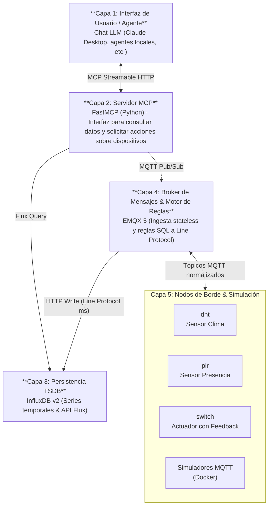

# SensorHub 🌐🤖

> **Taller de Proyecto II (2026) — Grupo G4**
> Plataforma IoT para interacción con Modelos de Lenguaje (LLM) mediante **Model Context Protocol (MCP)**.

---

## 📋 Tabla de Contenidos

- [Inicio Rápido](#-inicio-rápido)
- [Descripción del Proyecto](#-descripción-del-proyecto)
- [Arquitectura del Sistema](#-arquitectura-del-sistema)
- [Principios Rectores](#-principios-rectores-de-arquitectura)
- [Flujos de Información](#-flujos-de-información-de-punta-a-punta)
- [Tecnologías Principales](#-tecnologías-principales)
- [Contrato de Mensajería MQTT](#-contrato-de-mensajería-mqtt)
- [Infraestructura y Pipeline](#-infraestructura-y-pipeline-emqx--influxdb)
- [Servidor MCP y LLM](#-servidor-mcp-y-llm)
- [Obtención del Proyecto](#-obtención-del-proyecto)
- [Documentación y Wiki](#-documentación-y-wiki)

---

## 🚀 Inicio Rápido

> **Requisito:** tener [Docker Desktop](https://www.docker.com/products/docker-desktop/) instalado y corriendo.

Cloná el repositorio y ejecutá el script desde la raíz del proyecto:

**Windows (PowerShell):**
```powershell
# Stack base (EMQX + InfluxDB + MCP + Inspector)
.\start.ps1

# Stack completo + simuladores de sensores
.\start.ps1 -Simuladores

# Detener todo
.\start.ps1 -Detener
```

**Linux / macOS (bash):**
```bash
# Dar permisos la primera vez
chmod +x start.sh

# Stack base
./start.sh

# Stack completo + simuladores de sensores
./start.sh --simuladores

# Detener todo
./start.sh --detener
```

Al finalizar el script, las interfaces estarán disponibles en:

| Servicio | URL | Usuario / Contraseña |
| :--- | :--- | :--- |
| EMQX Dashboard | http://localhost:18083 | `admin` / `admin` |
| InfluxDB UI | http://localhost:8086 | `admin` / `adminpassword123` |
| MCP Inspector | http://localhost:6274 | — (conectar a `http://sensorhub_mcp:8000/mcp`) |
| MCP API | http://localhost:8000/mcp | — |

---

## 📖 Descripción del Proyecto

**SensorHub** es un proyecto experimental que conecta la computación física y el Internet de las Cosas (IoT) con los Modelos de Lenguaje (LLM) y los agentes inteligentes. Los nodos IoT —basados en microcontroladores, sensores y actuadores— intercambian información mediante tópicos MQTT estandarizados. EMQX procesa los mensajes y las reglas del sistema persisten las series temporales y los eventos en InfluxDB.

El servidor **Model Context Protocol (MCP)** ofrece a los asistentes de IA una interfaz estandarizada para consultar la información de los dispositivos y, cuando corresponda, solicitar acciones sobre ellos. Así, el modelo puede interpretar solicitudes en lenguaje natural sin necesitar conocer los detalles internos de MQTT ni de la base de datos.

La arquitectura mantiene desacoplados los dispositivos, el almacenamiento y la interfaz con el LLM: los nodos siguen publicando datos aunque el servidor MCP o el modelo no estén disponibles, y la información histórica permanece en InfluxDB.

---

## 🏛️ Arquitectura del Sistema

El sistema opera bajo un esquema desacoplado de **5 capas**:



---

## 🧭 Principios Rectores de Arquitectura

El diseño del stack Firmware ↔ MQTT ↔ TSDB se rige por cuatro premisas fundamentales:

1. **Desacoplamiento total de sensores:** Los microcontroladores solo interactúan con tópicos estandarizados en el broker MQTT. Si el servidor MCP o el LLM están apagados, los sensores continúan midiendo y registrando en la base de datos sin afectación alguna.

2. **Fuente Única de Verdad (*Single Source of Truth*):** La identidad y la clase funcional de un dispositivo residen exclusivamente en la estructura del tópico MQTT (`sensorhub/<device_type>/<device_id>/<canal>`). Los cuerpos de mensaje en JSON contienen únicamente la información propia de cada sensor, sin redundar metadatos.

3. **Broker Efímero vs. Persistencia en TSDB:** El broker EMQX es 100% libre de estado (*stateless*) — puede destruirse o recrearse en frío en cualquier momento sin perder historia. Toda la persistencia de series temporales, confirmaciones de actuadores y eventos de ciclo de vida recae en **InfluxDB v2**, que sí tiene almacenamiento persistente.

4. **Escalabilidad horizontal:** La arquitectura soporta diferentes *tipos* de dispositivo, cada uno con múltiples instancias identificadas por `device_id`. La estructura de los tópicos refleja esta jerarquía y permite incorporar nuevos tipos de nodo sin modificar el stack de backend.

---

## 🔄 Flujos de Información de Punta a Punta

### Escenario A — Telemetría Climática y Eventos de Presencia (Query Path)

```
Sensor DHT/PIR → MQTT (sensorhub/dht/<id>/telemetry)
    → EMQX Rule Engine (SQL)
    → InfluxDB v2 (Line Protocol, ts en ms)
    → MCP Server (consulta Flux)
    → LLM (respuesta en lenguaje natural)
```

1. El sensor DHT lee temperatura y humedad periódicamente.
2. El firmware genera un payload JSON con timestamp de origen (`ts`) y publica en `sensorhub/dht/<id>/telemetry`.
3. El motor de reglas de EMQX intercepta la publicación, extrae identificadores del tópico vía SQL, construye la línea en Line Protocol y realiza un HTTP POST a InfluxDB.
4. InfluxDB indexa los tags `device_type` y `device_id`, y guarda los campos numéricos en la serie temporal.
5. Al consultar el LLM *"¿Cuál fue la temperatura promedio del living en la última semana?"*, el servidor MCP ejecuta la tool correspondiente con una consulta Flux a InfluxDB y devuelve los datos consolidados.

### Escenario B — Conmutación de Actuador con Confirmación Física (Command Path)

```
LLM → MCP Tool (set_switch_state)
    → MQTT Publish (sensorhub/switch/<id>/command)
    → ESP32 actúa físicamente (GPIO)
    → ESP32 publica acuse (sensorhub/switch/<id>/telemetry)
    → MCP Server confirma al LLM
    → EMQX Rule Engine → InfluxDB (registra estado histórico)
```

1. El usuario solicita al LLM: *"Apaga la luz de la oficina"*.
2. El LLM invoca `set_switch_state(device_id="<id>", state="off")`.
3. El servidor MCP publica en `sensorhub/switch/<id>/command` el payload `{"state": "off"}` y aguarda síncronamente la respuesta en el canal de telemetría.
4. El microcontrolador conmuta el GPIO físicamente, verifica el pin y emite el acuse en `sensorhub/switch/<id>/telemetry`: `{"state": "off", "ts": <epoch_ms>}`.
5. El servidor MCP recibe la confirmación y le informa al LLM con certeza que la acción fue ejecutada (no solo que el broker recibió el mensaje).
6. Simultáneamente, EMQX guarda en InfluxDB el nuevo estado (`state="off"`, `value=0`) para el registro histórico.

---

## 🛠️ Tecnologías Principales

| Componente | Tecnología | Rol en la Plataforma |
| :--- | :--- | :--- |
| **Protocolo de IA** | [Model Context Protocol (FastMCP)](https://modelcontextprotocol.io/) | Servidor MCP en Python que expone herramientas de consulta y control al LLM. Transporte Streamable HTTP. |
| **Broker MQTT** | [EMQX 5](https://www.emqx.io/) | Ingesta de mensajería de alta concurrencia y motor de reglas SQL *stateless* que escribe directamente en InfluxDB. |
| **Base de Datos** | [InfluxDB v2](https://www.influxdata.com/) | Almacenamiento optimizado de métricas y eventos en series temporales con lenguaje de consulta Flux. |
| **Microcontroladores** | [ESP32 (ESP-IDF)](https://www.espressif.com/) | Nodos embebidos en C para captura de sensores y control de hardware con LWT y timestamp de origen. |
| **Virtualización** | Docker & Docker Compose | Despliegue contenerizado del stack de backend (EMQX + InfluxDB) y entornos de simulación. |

### Model Context Protocol (MCP)

Estándar abierto promovido por Anthropic que define cómo los modelos de lenguaje interactúan con herramientas y datos externos. Provee tres primitivas:

- **Tools:** Funciones ejecutables invocadas por el LLM con parámetros estructurados (JSON Schema). Mecanismo principal de SensorHub.
- **Resources:** Archivos o datos de contexto leídos pasivamente por el LLM (ej. catálogo de dispositivos registrados).
- **Prompts:** Guías interactivas predefinidas para orientar al usuario.

### MQTT — Mecanismos Clave para IoT

| Mecanismo | Descripción | Uso en SensorHub |
| :--- | :--- | :--- |
| **QoS 1** | At least once — confirmación de recepción | Telemetría DHT, PIR, Switch (piso mínimo) |
| **QoS 2** | Exactly once — entrega única garantizada | Dispositivos toggle críticos |
| **Retain** | Último valor guardado en el broker | Estado de actuadores, disponibilidad de dispositivos |
| **LWT** | Last Will and Testament — mensaje automático al desconectarse | Detección de dispositivos caídos sin polling activo |

### InfluxDB v2 — Modelo de Datos

```text
Measurement:  dht_telemetry
Tags:         device_type=dht, device_id=983dae529858
Fields:       temperature=22.5, humidity=48.0
Timestamp:    1727891234567 (epoch ms)

# Line Protocol de escritura:
dht_telemetry,device_type=dht,device_id=983dae529858 temperature=22.5,humidity=48.0 1727891234567
```

---

## 📡 Contrato de Mensajería MQTT

### Formato de Tópico Canónico

```
sensorhub/<device_type>/<device_id>/<canal>
```

- `<device_type>`: Clase funcional (`dht`, `pir`, `switch`).
- `<device_id>`: MAC Wi-Fi del ESP32 sin separadores, en minúsculas (ej. `983dae529858`).
- `<canal>`: Dirección del flujo de datos (`telemetry`, `command`, `status`).

> **Reglas de diseño:** Payloads en JSON estricto, claves en minúsculas, sin redundar metadatos del tópico en el cuerpo del mensaje.

### Timestamp de Origen (`ts`)

Todos los payloads de dispositivos vivos incluyen la clave `ts` con el valor **Epoch en milisegundos** tomado en el propio nodo. Garantiza precisión temporal independientemente de la latencia de red o del broker.

**Excepción:** El mensaje LWT (`{"online": false}`) se preconfigura antes de la conexión y no incluye `ts`.

### Especificación por Tipo de Dispositivo

#### Sensor DHT (Temperatura / Humedad)

| Canal | QoS | Retain | Payload ejemplo |
| :--- | :---: | :---: | :--- |
| `sensorhub/dht/<id>/telemetry` | 1 | ✅ | `{"temperature": 22.5, "humidity": 48.0, "ts": 1727891234567}` |
| `sensorhub/dht/<id>/status` (connect) | 1 | ✅ | `{"online": true, "ts": 1727891234567}` |
| `sensorhub/dht/<id>/status` (LWT) | 1 | ✅ | `{"online": false}` |

#### Sensor PIR (Detección de Presencia)

| Canal | QoS | Retain | Payload ejemplo |
| :--- | :---: | :---: | :--- |
| `sensorhub/pir/<id>/telemetry` | 1 | ❌ | `{"motion": true, "ts": 1727891234567}` |
| `sensorhub/pir/<id>/status` | 1 | ✅ | `{"online": true, "ts": 1727891234567}` |

> **¿Por qué `retain=false` en PIR?** Evita falsos positivos: un nuevo subscriptor no debe recibir un evento de movimiento antiguo que ya no es válido.

#### Actuador Switch (Relé / Luz)

| Canal | QoS | Retain | Payload ejemplo |
| :--- | :---: | :---: | :--- |
| `sensorhub/switch/<id>/command` | 1 | ❌ | `{"state": "on"}` |
| `sensorhub/switch/<id>/telemetry` | 1 | ✅ | `{"state": "on", "ts": 1727891234567}` |
| `sensorhub/switch/<id>/status` | 1 | ✅ | `{"online": true, "ts": 1727891234567}` |

> **El feedback loop:** El ESP32 publica en `telemetry` *únicamente después* de ejecutar y verificar físicamente el cambio de GPIO, garantizando confirmación real del hardware.

---

## ⚙️ Infraestructura y Pipeline EMQX + InfluxDB

### Stack Docker Compose

| Servicio | Imagen | Almacenamiento | Rol |
| :--- | :--- | :--- | :--- |
| **EMQX** | `emqx:5.8` | Efímero | Broker MQTT + Motor de Reglas SQL |
| **InfluxDB** | `influxdb:2.7` | Persistente (volumen) | Base de datos de series temporales |
| **Simuladores** | Imágenes custom | - | Dispositivos virtuales para desarrollo |

### Motor de Reglas EMQX → InfluxDB

EMQX procesa cada mensaje MQTT mediante reglas SQL en tiempo real, **eliminando la necesidad de un servicio intermediario** (como Telegraf). La combinación EMQX + InfluxDB reduce la complejidad operativa del stack.

**Ejemplo de regla para sensor DHT:**

```sql
SELECT
  nth(2, split(topic, '/')) as device_type,
  nth(3, split(topic, '/')) as device_id,
  payload.temperature as temperature,
  payload.humidity as humidity,
  payload.ts as ts
FROM "sensorhub/dht/+/telemetry"
```

La regla extrae `device_type` y `device_id` del tópico directamente (sin redundar en el payload). Los datos se envían vía HTTP POST a InfluxDB en formato Line Protocol con precisión de milisegundos.

### Representación Dual de Estados Discretos

Los estados de actuadores se almacenan en InfluxDB con **doble representación**, generada mediante `CASE WHEN` en la regla SQL:

- **Semántica:** `state="on"` (string) — para legibilidad y auditoría.
- **Numérica:** `value=1i` (integer) — para agregaciones analíticas (promedios, porcentajes de tiempo activo).

---

## 🤖 Servidor MCP y LLM

### FastMCP y Arquitectura Modular (Python)

El servidor MCP está implementado en Python con la clase **FastMCP** del SDK oficial de MCP (paquete `mcp`, `from mcp.server.fastmcp import FastMCP`; no el paquete independiente `fastmcp`), expuesto mediante transporte **Streamable HTTP** en el endpoint `/mcp` (puerto por defecto `8000`). Este diseño permite la comunicación desacoplada y estandarizada con clientes LLM (como Claude Desktop, Claude Code o agentes autónomos), aislando la complejidad de los protocolos IoT (MQTT y Flux/InfluxDB).

El paquete `MCP/sensorhub_mcp/` está estructurado modularmente:

- `mcp_app.py`: Instancia y configuración del servidor FastMCP.
- `mqtt_client.py`: Cliente MQTT ligero para lectura directa de mensajes retenidos (`retain=true`) con baja latencia.
- `influx_client.py`: Cliente de InfluxDB v2 para consultas analíticas y agregaciones temporales con Flux.
- `devices.py`: Carga y gestión del registro de dispositivos (`devices.csv`), con soporte de búsqueda aproximada y validación de seguridad de IDs.
- `timeutils.py`: Parseo y normalización de timestamps ISO 8601 a formatos compatibles con RFC3339 de Flux.
- `tools/`: Catálogo de tools invocables por el LLM (`climate.py`, `device_resolution.py`).

---

### Principios de Diseño Normativo de Tools (Wiki 06)

Siguiendo las definiciones de la **Wiki 06 ([Diseño de Tools MCP por Dispositivo](https://github.com/tpII/2026-g4-sensorhub/wiki/06-Diseno-de-Tools-MCP-por-Dispositivo))**, el servidor implementa los siguientes criterios de diseño:

1. **Tools Específicas por Dispositivo vs. Genéricas:**
   - Se evitan tools genéricas como `publicar_topico` o `query_influx(flux)`. Estas obligarían al LLM a conocer detalles internos del backend (nombres de *measurements* o *fields*) y crearían un vector crítico de **prompt injection** con capacidades destructivas en la base de datos o el broker.
   - Las tools son fuertemente tipadas y con docstrings auto-contenidos, guiando al modelo de forma determinística.

2. **Una Tool por Forma de Respuesta:**
   - Se descartan herramientas con parámetros condicionales ambiguos (como un parámetro `mode` para alternar entre valor puntual o histórico).
   - Se dividen en tools para lecturas de un instante (`get_current_climate`, `get_climate_at`) y tools para tendencias agregadas (`get_climate_trend`).

3. **Respuestas en Lenguaje Natural Sintetizado:**
   - En lugar de devolver objetos JSON crudos que el LLM deba interpretar, las tools retornan oraciones claras y contextualizadas con unidades (°C, %), marcas de tiempo legibles y avisos de estado.

4. **Resolución de Identidades en Dos Pasos (`resolve_device_id`):**
   - El usuario común interactúa mediante descripciones amigables (*"el sensor del living"*, *"la luz de la oficina"*).
   - El LLM realiza un encadenamiento en dos fases:
     1. Invoca `resolve_device_id(description, device_type)` para traducir la descripción al `device_id` canónico. El LLM extrae la descripción del mensaje del usuario; el servidor la normaliza (minúsculas, sin artículos ni preposiciones) y la compara con búsqueda difusa (`difflib`, umbral 0,8) sobre `devices.csv`. Ver Wiki 06, sección 2.4.
     2. Llama a la tool de datos correspondiente utilizando dicho `device_id`.
   - Si no hay coincidencia certera, la tool prefiere solicitar aclaración antes de devolver un dispositivo erróneo.
   - Si el usuario da el `device_id` (la MAC del dispositivo), el LLM puede saltear `resolve_device_id` y llamar directo a la tool de datos. El servidor lleva el id a su forma canónica (minúsculas, sin separadores) y verifica que esté registrado en `devices.csv`; si no lo está, responde que no corresponde a ningún dispositivo en vez de "no hay datos". Ver Wiki 06, sección 2.5.

5. **Detección de Datos Desactualizados (*Stale Data*):**
   - Dado que los mensajes MQTT retenidos no expiran automáticamente, si el `ts` del payload retenido supera un umbral de obsolescencia (`MQTT_STALE_AFTER_SECONDS = 30`), la tool advierte explícitamente que el sensor podría estar desconectado.

6. **Uso de las primitivas y mecanismos del estándar MCP:**
   - **Esquemas de parámetros:** cada parámetro se declara con `Annotated[..., Field(description=...)]`, de modo que su descripción y sus restricciones (patrón del `device_id`, `enum` de `device_type`, formato `date-time` de las fechas) viajan en el JSON Schema y el SDK rechaza argumentos inválidos antes de ejecutar la tool.
   - **Errores con `isError`:** las fallas (dispositivo no registrado, rango inválido, InfluxDB caído) se informan con `ToolError`, que el cliente recibe como resultado con `isError: true`.
   - **Anotaciones de tools:** todas declaran `readOnlyHint`, `idempotentHint`, `destructiveHint=false` y `openWorldHint=false`.
   - **Tools asíncronas:** el I/O bloqueante (MQTT, InfluxDB) corre en un hilo aparte, así una consulta lenta no frena al resto de los clientes.
   - **Lifespan:** el cliente de InfluxDB se crea al arrancar el servidor y se cierra al apagarlo.
   - **Resource `sensorhub://device-types`:** catálogo de tipos de dispositivo como contexto de solo lectura.
   - **Instructions:** guía general para el modelo, entregada al conectarse.
   - **Elicitation:** si `resolve_device_id` no identifica el dispositivo y el cliente lo soporta, le pide al usuario que elija entre los registrados.
   - **Logging por el protocolo:** capacidad `logging` declarada y nivel configurable por sesión (`logging/setLevel`).
   - **Seguridad y escalado:** validación de `Host`/`Origin` contra *DNS rebinding* (`MCP_ALLOWED_HOSTS`, `MCP_ALLOWED_ORIGINS`) y modo `MCP_STATELESS_HTTP` opcional para correr varias réplicas (sin elicitation).

---

### Catálogo de Tools Implementadas

| Tool | Argumentos | Fuente / Estrategia | Descripción |
| :--- | :--- | :--- | :--- |
| `resolve_device_id` | `description: str`, `device_type: "dht" \| "pir" \| "switch"` (opcional) | Registro local (`devices.csv`) + `difflib` | Traduce lenguaje libre al `device_id` canónico exacto. |
| `get_current_climate` | `device_id: str` | MQTT (`retain=true`) con fallback a InfluxDB `last()` | Retorna temperatura y humedad actuales con marca de tiempo UTC. |
| `get_climate_at` | `device_id: str`, `timestamp: datetime` (ISO 8601) | InfluxDB v2 (última lectura en los 60 s previos al instante) | Recupera la lectura climática vigente en un momento puntual del pasado. |
| `get_climate_trend` | `device_id: str`, `start: datetime`, `end: datetime` | InfluxDB v2 (agregaciones `min`, `max`, `mean`) | Resume la variación climática en lenguaje natural en un rango de tiempo. |

#### Roadmap de Tools por Dispositivo (según Wiki 06)

- **Sensor PIR (Presencia):**
  - `get_last_motion_state(device_id)`: Último estado registrado (solo InfluxDB).
  - `had_motion_in_range(device_id, start, end)`: Consulta booleana si hubo actividad.
  - `get_last_motion_event(device_id)`: Última detección positiva (`motion=true`).
  - `count_motion_events(device_id, start, end)`: Conteo de transiciones de entrada.
- **Actuador Switch (Relé):**
  - `set_switch_state(device_id, state)`: Publica en `command` y verifica confirmación en `telemetry`.
  - `get_switch_state(device_id)`: Estado de conmutación actual.
  - `get_switch_on_duration(device_id, start, end)`: Tiempo acumulado encendido.
  - `count_switch_toggles(device_id, start, end)`: Cantidad de conmutaciones en el rango.
- **Supervisión de Estado (Status):**
  - `get_device_availability(device_type, device_id)`: Diagnóstico de conectividad MQTT / LWT.

---

### Estrategia de Consulta: MQTT vs. InfluxDB

| Dispositivo | `retain` | Estrategia de Lectura | Justificación Técnica |
| :--- | :---: | :--- | :--- |
| **DHT** (clima) | ✅ | **MQTT primero**, cae a **InfluxDB** si falla o no hay retención | Mínima latencia para el dato actual; InfluxDB para rangos y caídas. |
| **PIR** (presencia) | ❌ | **Directamente InfluxDB** | `retain=false` previene falsos positivos de movimiento viejo. |
| **Switch** (actuador) | ✅ | **MQTT** para estado actual; **InfluxDB** para auditoría y métricas | El estado retenido refleja la confirmación del último cambio físico. |
| **Status** (LWT) | ✅ | **MQTT** (tópico de estado) | Broker entrega de inmediato si el nodo está conectado o desconectado. |

---

### Despliegue y Ejecución del Servidor MCP

#### 1. Prerrequisitos
El servidor MCP consulta los datos que generan el Stack y los simuladores. Antes de iniciarlo:
```bash
# 1. Levantar EMQX e InfluxDB
cd Stack && docker compose up -d

# 2. Levantar los simuladores de sensores
cd simuladores-mqtt && docker compose up -d
```

#### 2. Opciones de Ejecución

- **Opción A — Python local (recomendado para desarrollo y depuración):**
  ```bash
  cd MCP
  cp .env.example .env        # Ajustar hosts a localhost si se ejecuta fuera de Docker
  pip install -r requirements.txt
  python -m sensorhub_mcp
  ```

- **Opción B — Contenedor Docker (integrado en la red del Stack):**
  ```bash
  cd MCP
  docker compose up -d --build
  ```
  El servicio se conecta a `sensorhub_network` y resuelve `sensorhub_emqx` e `sensorhub_influxdb` automáticamente.

El servidor quedará disponible en `http://localhost:8000/mcp`.

---

### Pruebas y Validación

1. **Cliente MCP mínimo en Python:** las tools son asíncronas y reciben el contexto del servidor, así que se prueban a través del protocolo con el cliente oficial del SDK (`pip install mcp`). El ejemplo completo está en [`MCP/README.md`](MCP/README.md#1-con-un-cliente-mcp-mínimo-en-python); los errores llegan con `isError == True`.

2. **MCP Inspector (interfaz gráfica para depurar tools):**
   ```bash
   cd MCP
   docker compose up -d mcp-inspector
   ```
   Abrir `http://localhost:6274` en el navegador y conectar a `http://sensorhub_mcp:8000/mcp` (dentro de Docker) o `http://localhost:8000/mcp` (si se usa `npx @modelcontextprotocol/inspector`).

3. **Conexión a Clientes LLM Reales (Claude Desktop / Agentes):**
   Agregar el servidor MCP como endpoint remoto por URL (`http://localhost:8000/mcp`) en la configuración del cliente.

4. **Acceso Remoto desde Modelos en la Nube:**
   Para conectar modelos o servicios externos sin IP pública, se puede exponer el puerto mediante un túnel:
   ```bash
   ngrok http 8000
   ```
   Y configurar en el cliente la URL pública resultante: `https://<dominio-ngrok>.ngrok-free.app/mcp`.

---

## 🚀 Obtención del Proyecto

```bash
git clone https://github.com/tpII/2026-g4-sensorhub.git
cd 2026-g4-sensorhub
```

### Estructura del Repositorio

```
2026-g4-sensorhub/
├── Firmware/                 # Código ESP32 en C (ESP-IDF) — pendiente, aún sin contenido
├── MCP/                      # Servidor FastMCP (Python)
│   ├── sensorhub_mcp/        # Paquete modular del servidor
│   │   ├── tools/            # Implementación de tools (climate, device_resolution, common)
│   │   ├── resources.py      # Resource sensorhub://device-types
│   │   ├── config.py         # Carga de variables de entorno
│   │   ├── devices.py        # Registro y matching difuso de dispositivos
│   │   ├── influx_client.py  # Consultas Flux y agregaciones a InfluxDB
│   │   ├── mqtt_client.py    # Cliente MQTT para mensajes retenidos
│   │   ├── mcp_app.py        # FastMCP: lifespan, seguridad HTTP, instrucciones, logging
│   │   ├── timeutils.py      # Conversión de timestamps ISO 8601 a Flux
│   │   └── main.py           # Entrypoint del servidor
│   ├── devices.csv           # Registro de mapeo (living -> dht_simulado, etc.)
│   ├── docker-compose.yml    # Despliegue de mcp-server y mcp-inspector
│   ├── Dockerfile
│   ├── requirements.txt
│   └── README.md             # Guía detallada de uso del componente MCP
├── Stack/                    # Docker Compose de infraestructura
│   ├── docker-compose.yml    # EMQX 5.8 + InfluxDB 2.7
│   ├── simuladores-mqtt/     # Simuladores Python de DHT, PIR y Switch
│   └── README.md             # Guía de configuración del stack y reglas SQL
├── start.ps1                 # Script de inicio rápido para Windows (PowerShell)
├── start.sh                  # Script de inicio rápido para Linux / macOS (bash)
└── README.md                 # Documentación general del proyecto
```

---

## 📚 Documentación y Wiki

| Página | Contenido |
| :--- | :--- |
| 📘 [01. Visión y Arquitectura](https://github.com/tpII/2026-g4-sensorhub/wiki/01-Vision-y-Arquitectura) | Propósito del proyecto, principios rectores y flujos de información |
| 🔧 [02. Tecnologías y Conceptos Clave](https://github.com/tpII/2026-g4-sensorhub/wiki/02-Tecnologias-y-Conceptos-Clave) | MCP, MQTT, EMQX e InfluxDB — fundamentos y criterios de selección |
| 📡 [03. Contrato de Mensajería MQTT](https://github.com/tpII/2026-g4-sensorhub/wiki/03-Contrato-de-Mensajeria-MQTT) | Especificación de tópicos, payloads, QoS y estrategias por dispositivo |
| ⚙️ [04. Infraestructura y Pipeline EMQX-InfluxDB](https://github.com/tpII/2026-g4-sensorhub/wiki/04-Infraestructura-y-Pipeline-EMQX-InfluxDB) | Stack Docker, reglas SQL y representación dual de estados |
| 🤖 [05. Servidor MCP y LLM](https://github.com/tpII/2026-g4-sensorhub/wiki/05-Servidor-MCP-y-LLM) | FastMCP, transporte Streamable HTTP, arquitectura y diseño de tools |
| 🧭 [06. Diseño de Tools MCP por Dispositivo](https://github.com/tpII/2026-g4-sensorhub/wiki/06-Diseno-de-Tools-MCP-por-Dispositivo) | Criterios normativos, catálogo por sensor/actuador y resolución en dos pasos |
| 📓 [Bitácora de Avance Semanal](https://github.com/tpII/2026-g4-sensorhub/wiki/Bitacora) | Registro cronológico del progreso del equipo |

---

> *Taller de Proyecto II — Facultad de Ingeniería — 2026*
