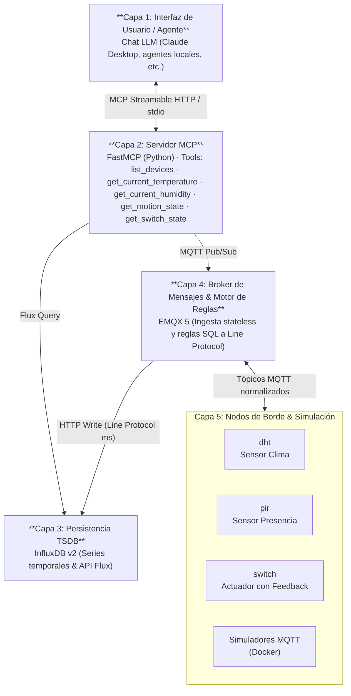

# SensorHub 🌐🤖

> **Taller de Proyecto II (2026) — Grupo G4**  
> Plataforma IoT para interacción con Modelos de Lenguaje (LLM) mediante **Model Context Protocol (MCP)**.

---

## 📖 Descripción del Proyecto

**SensorHub** es una plataforma IoT que permite a modelos de lenguaje (LLM) interactuar con sensores y actuadores físicos a través del protocolo MCP (*Model Context Protocol*).

A través de herramientas (*tools*) estandarizadas, asistentes de Inteligencia Artificial (como Claude, Gemini o modelos locales) pueden:

* 🌡️ **Consultar telemetría ambiental:** Lecturas en tiempo real e históricas de temperatura y humedad (sensores DHT).
* 🚨 **Monitorear eventos de presencia:** Detección de movimiento reactiva (sensores PIR).
* 💡 **Controlar actuadores físicos:** Inspección y conmutación de estado en relés y luces con confirmación física (*feedback loop*).
* 🔍 **Descubrir dispositivos activos:** Descubrimiento dinámico de la flota (`list_devices`) y supervisión de conectividad mediante *Last Will and Testament (LWT)*.
* ⏱️ **Registrar eventos con precisión temporal:** Ingesta de datos con marcas de tiempo en milisegundos (`ts`) propagadas desde el origen hacia la base de datos de series temporales.

---

## 🏛️ Arquitectura del Sistema

El sistema opera bajo un esquema desacoplado de **5 capas**:



---

## 🛠️ Tecnologías Principales

| Componente | Tecnología | Rol en la Plataforma |
| :--- | :--- | :--- |
| **Protocolo de IA** | [Model Context Protocol (FastMCP)](https://modelcontextprotocol.io/) | Servidor MCP en Python que expone las herramientas de consulta y control al LLM. |
| **Broker MQTT** | [EMQX 5](https://www.emqx.io/) | Ingesta de mensajería de alta concurrencia y motor de reglas SQL *stateless*. |
| **Base de Datos** | [InfluxDB v2](https://www.influxdata.com/) | Almacenamiento optimizado de métricas y eventos en series temporales con Flux. |
| **Microcontroladores** | [ESP32 (ESP-IDF)](https://www.espressif.com/) | Nodos embebidos en C para captura de sensores y control de hardware. |
| **Virtualización** | Docker & Docker Compose | Despliegue contenerizado del stack de backend y entornos de simulación. |

---

## 🚀 Obtención del Proyecto

Para clonar el repositorio localmente:

```bash
git clone https://github.com/tpII/2026-g4-sensorhub.git
cd 2026-g4-sensorhub
```

---

## 📚 Documentación y Wiki

Para conocer el detalle técnico del diseño normativo, contratos y bitácora del proyecto:

* 📘 **[Wiki Oficial del Proyecto](https://github.com/tpII/2026-g4-sensorhub/wiki)**
  * [[01. Visión y Arquitectura]](https://github.com/tpII/2026-g4-sensorhub/wiki/01-Vision-y-Arquitectura)
  * [[02. Tecnologías y Conceptos Clave]](https://github.com/tpII/2026-g4-sensorhub/wiki/02-Tecnologias-y-Conceptos-Clave)
  * [[03. Contrato de Mensajería MQTT]](https://github.com/tpII/2026-g4-sensorhub/wiki/03-Contrato-de-Mensajeria-MQTT)
  * [[04. Infraestructura y Pipeline EMQX-InfluxDB]](https://github.com/tpII/2026-g4-sensorhub/wiki/04-Infraestructura-y-Pipeline-EMQX-InfluxDB)
  * [[05. Servidor MCP y LLM]](https://github.com/tpII/2026-g4-sensorhub/wiki/05-Servidor-MCP-y-LLM)
  * [[Bitácora de Avance Semanal]](https://github.com/tpII/2026-g4-sensorhub/wiki/Bitacora)
