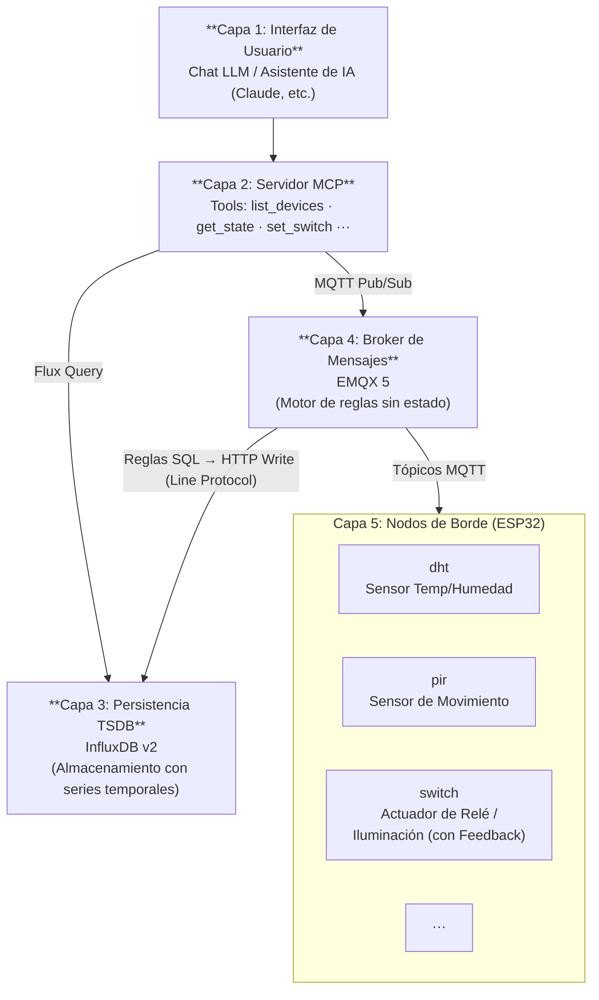

# SensorHub Stack

Infraestructura de backend contenerizada para la ingesta, enrutamiento, almacenamiento en series temporales y exposición contextual (MCP) de la telemetría de dispositivos IoT **SensorHub**.

El stack está diseñado bajo el principio **stateless & cold-boot**, permitiendo su despliegue reproducible e instantáneo en entornos de desarrollo o producción sin requerir configuraciones manuales en interfaces gráficas.

---

## Arquitectura del Sistema



### Componentes

1. **EMQX 5 (Broker MQTT & Motor de Reglas):**
   - Ingesta eventos y comandos con soporte para MQTT 3.1.1/5.0, TLS y WebSockets.
   - **Stateless:** No requiere volúmenes persistentes para su configuración. Se aprovisiona en frío mediante la plantilla declarativa base y módulos en [`broker/templates/`](broker/templates/) e inyección automática de variables de entorno mediante [`broker/docker-entrypoint.sh`](broker/docker-entrypoint.sh), sin exponer secretos en texto plano.

2. **InfluxDB v2 (Base de Datos de Series Temporales):**
   - Almacenamiento optimizado para métricas de sensores ambientales (`temperature`, `humidity`, `motion`).
   - **Aprovisionamiento Automático:** Se inicializa de forma desatendida mediante variables de entorno (`DOCKER_INFLUXDB_INIT_*`), creando la organización, bucket y token administrativo sin requerir el asistente web.
   - **Persistencia Aislada:** Utiliza un volumen de Docker (`influxdb_data`) únicamente para los datos de series temporales (`/var/lib/influxdb2`), manteniendo la configuración completamente declarativa.

3. **Servidor MCP (*Model Context Protocol* - PENDIENTE):**
   - Microservicio en Python utilizando `FastMCP` y `paho-mqtt`.
   - Permitirá a asistentes y agentes de Inteligencia Artificial consultar el estado de la red de sensores y despachar comandos de control en lenguaje natural mediante herramientas estandarizadas.

---

## Estructura del Directorio

```text
Stack/
├── .env.example              # Plantilla con variables de entorno por defecto
├── .env                      # Variables activas (ignorado por Git)
├── docker-compose.yml        # Definición de servicios y redes
├── MQTT.md                   # Especificación normativa de tópicos y payloads
├── README.md                 # Esta documentación
├── simuladores-mqtt          # Contiene algunos simuladores en docker para probar EMQX e Influx
└── broker/
    ├── templates/            # Plantillas bootstrap modulares HOCON (sin secretos)
    │   ├── emqx.conf.template# Configuración base del broker
    │   └── rules/            # Reglas y acciones por dispositivo
    ├── docker-entrypoint.sh  # Script de auto-discovery e inyección en frío
    └── README.md             # Guía del Data Bridge y nuevos dispositivos
```

---

## Guía de Inicio Rápido

### Prerrequisitos

- [Docker Engine](https://docs.docker.com/engine/install/) 20.10+
- [Docker Compose](https://docs.docker.com/compose/) v2.0+

### 1. Configuración de Entorno

Copiar el archivo de variables de entorno de ejemplo:

```bash
cd Stack
cp .env.example .env
```

Si es necesario, personalizar las credenciales en `.env` (usuario y contraseña de EMQX Dashboard, credenciales y token de InfluxDB).

### 2. Despliegue del Stack

Iniciar los servicios en segundo plano:

```bash
docker compose up # Opcional agregar -d para correr en modo desatendido
```

Opcionalmente para probar el intercambio de informacion simulando dispositivos IoT comunicandose con el broker: (mas info en simuladores-mqtt/README.md)

```bash
cd simuladores-mqtt
docker compose up 
```


### 3. Verificación de Estado

Comprobar que los contenedores estén en ejecución:

```bash
docker compose ps
```

> Nota: En el caso de buscar desde la UI de influx los datos de los sensores, recordar que algunos como switch y pir, envian un payload "state" o "motion" respectivamente, este ultimo es de tipo string y es el motor de reglas de EMQX el encargado de inyectar el payload "value" con valores numericos, por lo que para ver una serie temporal correctamente, solo deben seleccionarse los campos numericos ("value").

---

## Servicios, Puertos y Credenciales

| Servicio | Puerto Host | Protocolo / Propósito | Credenciales por Defecto |
| :--- | :--- | :--- | :--- |
| **EMQX Dashboard** | `18083` | HTTP (Consola Web) | `admin` / `admin` |
| **EMQX MQTT** | `1883` | TCP (Broker MQTT estándar) | Anónimo (Entorno Dev) |
| **EMQX TLS** | `8883` | TLS (Broker MQTT Seguro) | - |
| **EMQX WebSockets** | `8083` / `8084` | WS / WSS | - |
| **InfluxDB Web/API** | `8086` | HTTP (Dashboard y API Flux) | `admin` / `adminpassword123` |

> [NOTA]
> El token de administrador configurado por defecto para InfluxDB es:
> `sensorhub_admin_secret_token_123`
> La organización por defecto es `sensorhub` y el bucket es `sensorhub`.
> Estos son valores de **desarrollo local**, publicados a propósito en `.env.example` y como default en `docker-compose.yml` para que el stack levante sin pasos manuales. No son secretos de producción: si el stack se expone fuera de la máquina de desarrollo, deben reemplazarse por valores propios en `.env`.

---

## Pruebas y Validación

### Probar el Broker MQTT

En Stack/MQTT.md se encuentra informacion asociada a las pruebas.

### UI de InfluxDB en <http://localhost:8086> 

---

## Ciclo de Vida y Mantenimiento

- **Detener el stack conservando los datos de InfluxDB:**

  ```bash
  docker compose down
  ```

- **Reinicio completo desde cero (borrando datos persistidos):**

  ```bash
  docker compose down -v
  docker compose up -d
  ```

- **Ver logs en vivo:**

  ```bash
  docker compose logs -f
  # O logs de un servicio específico:
  docker compose logs -f emqx
  docker compose logs -f influxdb
  ```

---

## Documentación Relacionada

- [Especificación de Tópicos y Payloads MQTT](./MQTT.md): Detalle normativo de los tópicos, esquemas JSON y convenciones de nombres.
- [Firmware ESP32 (SensorHub)](../Firmware/sensorHub/README.md): Nodos sensores y actuadores (DHT, PIR, Switch). *(pendiente: el directorio `Firmware/` todavía no tiene contenido versionado)*
- [Herramientas y Utilidades de Firmware](../Firmware/utils/README.md): Scripts y utilidades de compilación, flasheo y monitoreo. *(pendiente, idem anterior)*
